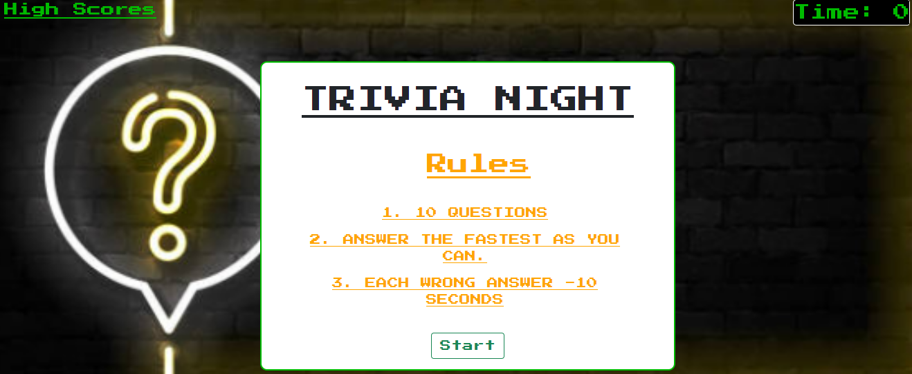
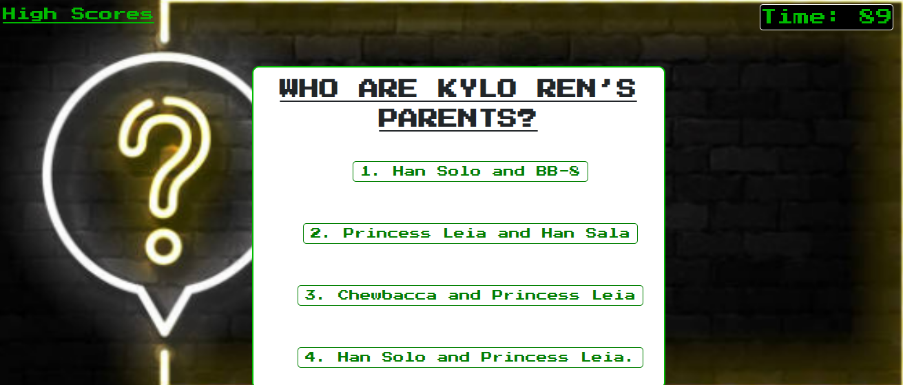
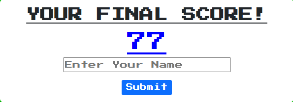
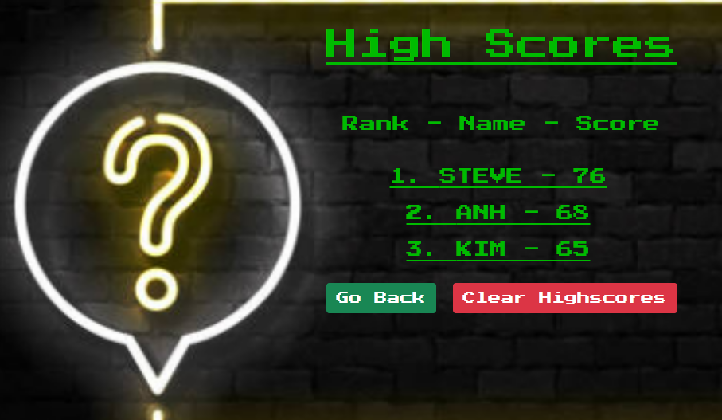

# Trivia Night
A fun multiple choice timed questions.

## Description
Trivia Night use the concepts of DOM traversal, setting attributes, event listeners, timers, intervals, local storage, and dynamically updated HTML and CSS.

## Technologies Used
* HTML 5
* CSS
* JavaScript
* Google Fonts
* Bootstrap

## Acceptance Criteria
* WHEN I visit the site for the first time 
* THEN I am presented with the homepage with the rules for the game.
* WHEN I click on the "Start" button.
* THEN the timer and series of question begin.
* WHEN I answer the question incorrect.
* THEN for every incorrect answer my timer will deduct 10 secounds.
* WHEN the timer or question run out.
* THEN I am presented with "Your Final Score!"
* WHEN I enter my name and submit.
* THEN I am presented with the High Scores board.
* WHEN I click on "Go Back" 
* THEN I am taking back to the homepage.
* WHEN I click on "Clear Highscores"
* Then I clear out my High Scores board.

_Homepage:_

_Question:_

_Score:_

_Scores Board_

## Deployed Application Link

Deployed Application https://anhcu.github.io/Trivia-Night/
 
Github Repo  https://github.com/anhcu/Trivia-Night

## Contact
* Email anhcu714@gmail.com

